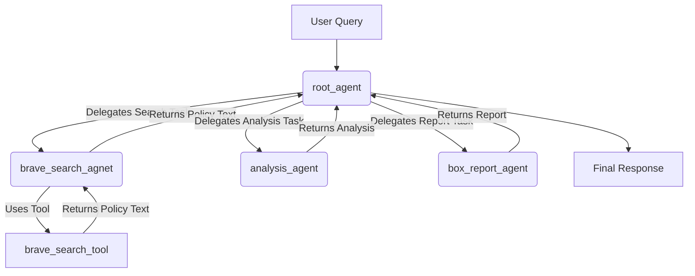

# Insurance Policy Comparison Agent

> A multi-agent system built with Google's Agent Development Kit (ADK) to find, analyze, and compare insurance policy documents from the web.

This project demonstrates a sophisticated agentic workflow where a hierarchy of AI agents collaborates to perform a complex task. The root agent orchestrates sub-agents responsible for searching the web for insurance policy PDFs, extracting their content, and performing detailed comparative analysis.

## Table of Contents
* [Overview](#overview)
* [Key Features](#key-features)
* [Why Google ADK?](#why-google-adk)
* [Architecture](#architecture)
* [Getting Started](#getting-started)
  * [Prerequisites](#prerequisites)
  * [Installation & Configuration](#installation--configuration)
* [How to Deploy and Run](#how-to-deploy-and-run)
  * [Local Development](#local-development)
  * [Deployment](#deployment)
* [Potential Customers & Use Cases](#potential-customers--use-cases)

## Overview

The Insurance Policy Comparison Agent is designed to automate the manual and time-consuming process of researching and comparing insurance policies. A user can provide a natural language query, such as *"Compare home insurance policies from Allstate and Progressive"*, and the agent system will:

1.  Formulate a detailed web search query to find relevant policy documents.
2.  Search the web, prioritizing PDF files which often contain detailed policy wordings.
3.  Extract the full text from these PDF documents.
4.  Analyze the content of the policies.
5.  Generate a comparative summary, a SWOT analysis, or even suggest a new, innovative insurance product based on gaps in the current market offerings.

## Key Features

- **Automated Web Research**: Uses the Brave Search engine to find insurance policy documents (PDFs) across the internet.
- **PDF Text Extraction**: Intelligently extracts text content from PDF documents found at a URL.
- **Multi-Agent System**: Utilizes a hierarchical structure of specialized agents for searching, analysis, and reporting.
- **Comparative Analysis**: Capable of performing in-depth comparisons and SWOT analyses of different policies.
- **Product Innovation**: Can identify market gaps from its analysis to propose new insurance products.
- **Secure API Key Management**: Leverages Google Cloud Secret Manager to securely handle API keys.

## Why Google ADK?

Google's Agent Development Kit (ADK) was chosen as the framework for this project for several key reasons:

- **Simplified Agent Creation**: ADK provides a clean and intuitive `Agent` class, making it straightforward to define an agent's model, tools, instructions, and metadata.
- **Seamless Multi-Agent Orchestration**: The project's power comes from its multi-agent hierarchy (`root_agent` delegating to `brave_search_agnet`, `analysis_agent`, etc.). ADK handles the complex orchestration, reasoning, and routing of requests between these agents automatically.
- **Effortless Tool Integration**: Integrating custom Python functions as tools for the agents is as simple as adding them to a list. ADK manages the schema generation and function-calling logic, allowing agents to use tools like `brave_search_tool` reliably.
- **Scalability and Extensibility**: The modular nature of ADK makes it easy to add new agents with new capabilities (like the `box_report_agent`) or to integrate additional tools without refactoring the entire system.
- **Built-in Development & Deployment**: The ADK CLI provides commands like `adk dev` for a rapid local development loop and `adk deploy` for straightforward deployment to a supported Google Cloud environment.

## Architecture

The system is built around a `root_agent` that acts as an orchestrator. It delegates tasks to specialized sub-agents:

1.  **`root_agent` (Insurance Policy Analysis Agent)**: The main entry point. It receives the user's request and decides which sub-agent to use to fulfill it.

2.  **`brave_search_agnet`**: This agent's sole purpose is to use the `brave_search_tool`. It takes a query, searches the web for insurance policy PDFs, and returns the extracted text from those documents.

3.  **`analysis_agent`**: This agent receives the policy text from the search agent. Its instructions are to perform a detailed comparison, summarize the findings, and, if requested, ideate a new insurance product by identifying market gaps.

4.  **`box_report_agent`**: This agent specializes in structuring the analysis into a specific format, such as a 4-box SWOT (Strengths, Weaknesses, Opportunities, Threats) report.



## Getting Started

### Prerequisites

- Python 3.9+
- A Google Cloud Platform (GCP) project.
- The `gcloud` CLI installed and authenticated.
- A Brave Search API Key.

### Installation & Configuration

1.  **Clone the repository:**
    ```sh
    git clone <your-repo-url>
    cd insurancesearchagentdemo
    ```

2.  **Set up a virtual environment:**
    ```sh
    python -m venv venv
    source venv/bin/activate
    ```

3.  **Install dependencies:**
    The `requirements.txt` file should be updated to include all necessary packages. See the recommended `requirements.txt` file in this project.
    ```sh
    pip install -r requirements.txt
    ```

4.  **GCP Authentication:**
    Log in with your user credentials for local development.
    ```sh
    gcloud auth application-default login
    gcloud config set project YOUR_GCP_PROJECT_ID
    ```

5.  **Enable APIs:**
    Ensure the Secret Manager API is enabled for your project.
    ```sh
    gcloud services enable secretmanager.googleapis.com
    ```

6.  **Store API Key in Secret Manager:**
    Store your Brave Search API key in Google Cloud Secret Manager.
    ```sh
    echo "YOUR_BRAVE_API_KEY" | gcloud secrets create bravesearchkey --data-file=-
    ```
    Grant your principal (user or service account) access to this secret.

## How to Deploy and Run

### Local Development

The ADK provides a local development server that hot-reloads on code changes, making it easy to test your agent.

1.  **Start the dev server:**
    From the root directory of the project (`insurancesearchagentdemo`), run:
    ```sh
    adk dev .
    ```

2.  **Interact with the agent:**
    Once the server is running, you can send requests to it. You will interact with the `root_agent`, which is `insurance_policy_analysis_agent`.
    ```sh
    # In a new terminal
    adk send 'Compare auto insurance policies from Geico and Progressive for a family in California, focusing on liability coverage and included benefits. Search for PDF documents.' --agent insurance_policy_analysis_agent
    ```

### Deployment

You can deploy the agent to a supported Google Cloud environment (like Cloud Run) using the ADK CLI.

1.  **Deploy the agent:**
    From the root directory, run:
    ```sh
    adk deploy .
    ```
    The CLI will guide you through the deployment process, including selecting the region and service account.

2.  **Invoke the deployed agent:**
    Once deployed, you can invoke the agent using its deployed name and your project ID.
    ```sh
    adk send 'Create a SWOT analysis comparing life insurance term policies from Prudential and MetLife.' --agent insurance_policy_analysis_agent --project YOUR_GCP_PROJECT_ID
    ```

## Potential Customers & Use Cases

-   **Insurance Companies (Product Development Teams):** Analyze competitor policies to identify market gaps, understand feature trends, and design new, competitive insurance products. The `analysis_agent` is specifically instructed to assist with this.

-   **Insurance Brokers & Agencies:** Quickly and automatically compare policies from different carriers for their clients. This allows them to provide more informed, data-driven recommendations and highlight key differentiators in coverage.

-   **Corporate Risk Managers:** Evaluate complex commercial insurance policies (e.g., D&O, E&O, Cyber) from multiple providers to ensure their organization has the most comprehensive and cost-effective coverage.

-   **Financial Analysts & Insurtechs:** Conduct large-scale market research on insurance products, track changes in policy wordings over time, and build datasets for further analysis.

-   **Regulators and Compliance Teams:** Monitor the market for compliance with regulations, compare policy language against standards, and identify potentially unfair or deceptive clauses.